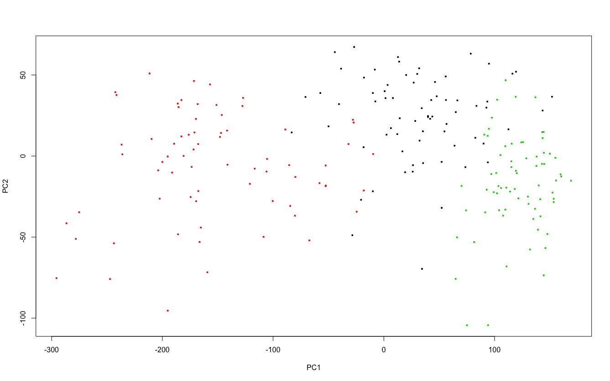
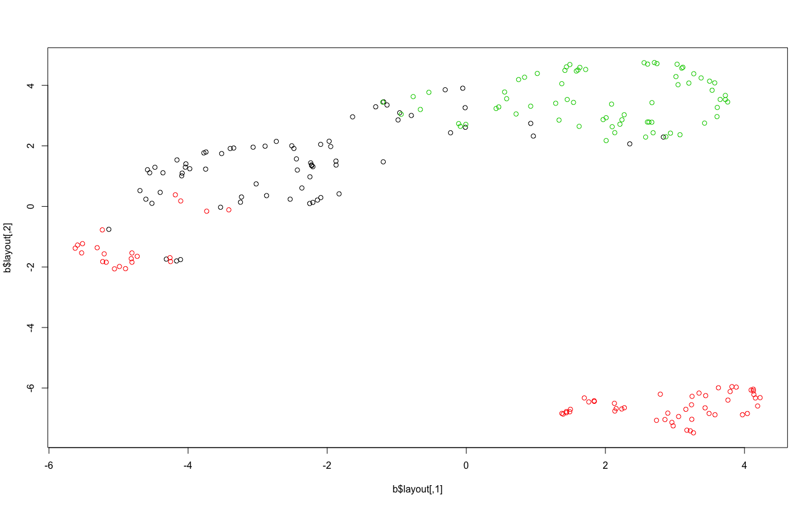
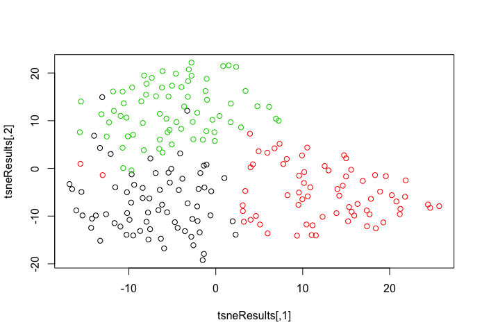

Wheat seeds data set from UCI Machine Learning Repository, can be downloaded
[here](https://archive.ics.uci.edu/ml/datasets/seeds)The examined group comprised kernels belonging to three different varieties of wheat: Kama, Rosa and Canadian, 70 elements each, randomly selected for
the experiment. So, in this dataset, we have 3 groups.

Below are the plots from **prVis**, **umap**, and **tsne**, in order.

In both tsne and prVis, different groups are well separated. In umap, some data belong to the group that is color coded by red are intermingled with the group color coded black. Further, in prVis, the three groups are "arranged" along the PC1 axis (the first principal component). So the PC1 can be used to "classify" the three diffent wheat types. 

