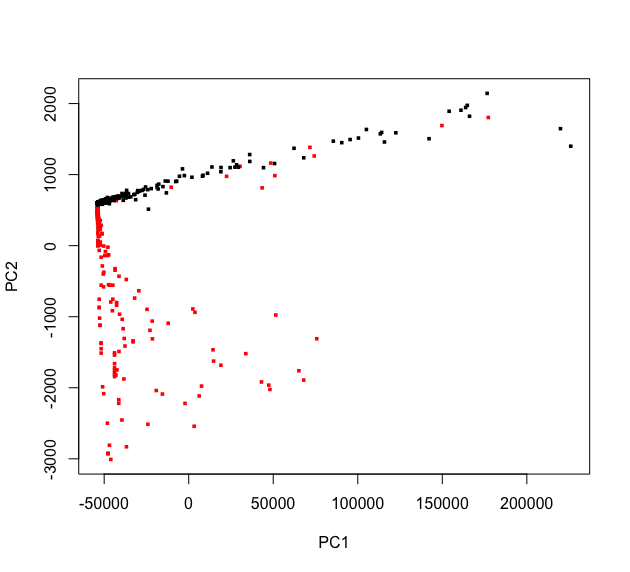
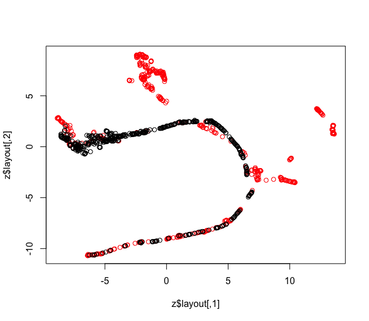
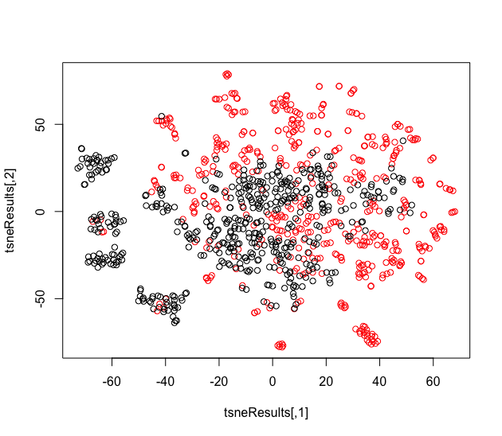

## Data
Data can be found [here](https://www.kaggle.com/mlg-ulb/creditcardfraud). The datasets contains transactions made by credit cards in September 2013 by european cardholders. Feature 'Time' contains the seconds elapsed between each transaction and the **first** transaction in the dataset. Thus, we preprocess the 'Time' column to be the time needed for each single transaction, rather than the accumulated time.

Also, since the dataset is highly unbalanced (492 frauds out of 284,807 transactions, which means 492 cases have label 1, and all others have label 0), we sample the data to make the sample "balanced". Below the graphs consist of 492 frauds and 492 normal transaction so that for each group they have same number of data points.

## Graph
#### prVis

The two groups are nearly perpendicular to each other, suggesting the distict natures of the fraud transactions and normal transactions. Whereas the plot from umap and t-sne reveal no obvious pattern. 
#### umap

#### t-sne

